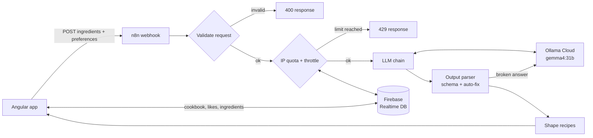

<div align="center">

# Code à Cuisine

**AI-powered recipe generator.** Enter what's in your kitchen, pick your preferences, and get three recipes cooked up by an AI agent.


</div>

## Features

- **Ingredients in, recipes out.** Add at least one ingredient with quantity and unit, and the AI builds three matching recipes around them.
- **Preferences.** Portions (1–12), number of cooks (1–3), cooking time (quick / medium / complex), cuisine (German, Italian, Indian, Japanese, Gourmet / Fine Dining, Fusion) and diets (vegetarian, vegan, keto, no restrictions).
- **Step-by-step directions.** Each recipe splits your ingredients from the extras it needs, assigns steps to the cooks, marks parallel steps and shows nutrition per portion and for the whole recipe.
- **Cookbook.** Every generated recipe is saved, five sample recipes are preinstalled. Browse by cuisine or all recipes (20 per page), see the most liked recipes and give your favourites a heart.
- **Fair use limit.** 3 generations per IP and 12 in total per calendar day plus a 15 second throttle, enforced in the workflow; Firebase only accepts "+1" on the counters.
- **Responsive.** Separate layouts for laptops and phones/tablets, in portrait and landscape.

## Screenshots

| Add ingredients | Choose preferences |
| :---: | :---: |
|  |  |
| **Your three recipes** | **Cookbook** |
|  |  |
| **Ingredients** | **Directions** |
|  |  |


## How it works



1. The app sends the ingredient list and preferences to the n8n webhook `code-a-cuisine-recipe`.
2. The workflow validates the request again (ingredients, quantities, units, portions, cooks, time, cuisine, diets) and answers invalid input with 400.
3. It takes the caller IP from the Cloudflare header (IPv4 or IPv6, stored only as a hash) and enforces 3 recipes per IP per day, 12 per day in total and a 15 second throttle in Firebase (429 with a readable message).
4. A Basic LLM Chain asks the model for three recipes. The rules of the request (at least 70 % of your ingredients, at most 3 extras, time frame, cooks, 4–12 steps, nutrition per portion and in total) are part of a JSON schema, and the Structured Output Parser enforces it; its auto-fix lets the model repair a broken answer.
5. Failures are logged in Firebase and answered with 500; crashes trigger the error workflow with an email.
6. The app stores the recipes in Firebase so they show up in the cookbook.

## Tech stack

| Layer | Technology |
| --- | --- |
| Frontend | Angular 22 (standalone components, signals), SCSS |
| Backend | n8n Cloud workflow (`n8n/code-a-cuisine-recipe-agent.json`) |
| AI | Ollama Cloud, `gemma4:31b`, via the OpenAI-compatible API |
| Database | Firebase Realtime Database (`database.rules.json`) |

## Getting started

```bash
git clone https://github.com/alexlindt-arch/code-a-cuisine.git
cd code-a-cuisine
npm install
npm start
```

The app runs on `http://localhost:4200`.

### Configuration

Both endpoints live in `src/environments/environment.ts` and `environment.prod.ts`:

```ts
const n8nBaseUrl = 'https://<your-name>.app.n8n.cloud/';

export const environment = {
  production: true,
  n8nBaseUrl,
  recipeWebhookUrl: `${n8nBaseUrl}webhook/`,
  firebaseDatabaseUrl: 'https://<your-project>-default-rtdb.<region>.firebasedatabase.app',
};
```

### Backend setup

- **n8n:** import the workflow, connect the model and activate it. See [`n8n/README.md`](n8n/README.md).
- **Firebase:** create a Realtime Database and deploy the rules with `firebase deploy --only database`. Also set the database URL in the *Check IP Quota* node of the workflow.

## Project structure

```
src/app/
├── hero/               start page
├── generate-recipe/    ingredient input with autocomplete
├── preferences/        preferences, quota handling, webhook request
├── results/            the three generated recipes
├── recipe-detail/      ingredients, nutrition chart and directions per cook
├── cookbook/           cookbook overview, most liked, preinstalled sample recipes
├── cookbook-category/  recipes per cuisine and all recipes, 20 per page
├── impress/            imprint
├── components/         header, button, link and image components
├── recipe-library.service.ts   Firebase access for recipes and likes
└── loading-state.service.ts    loading state shared with the header
n8n/                    workflow exports and setup guide
docs/screenshots/       README images
```

## Build, test and deploy

```bash
npm test               # unit tests (Vitest)
npx ng build           # production build in dist/Code-a-Cuisine/browser
```

The production build uses the base href `/Code-a-Cuisine/` and hash routing, so the `browser` folder can be uploaded to any static web space.

Live demo: https://alexander-lindt.developerakademie.net/Code-a-Cuisine/

## Author

**Alexander Lindt**: [GitHub](https://github.com/alexlindt-arch)
